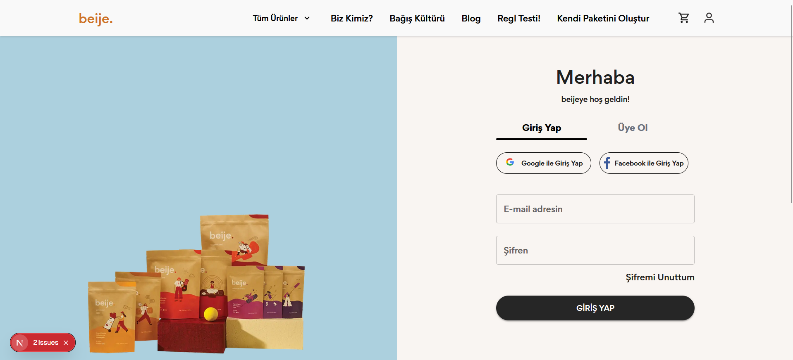
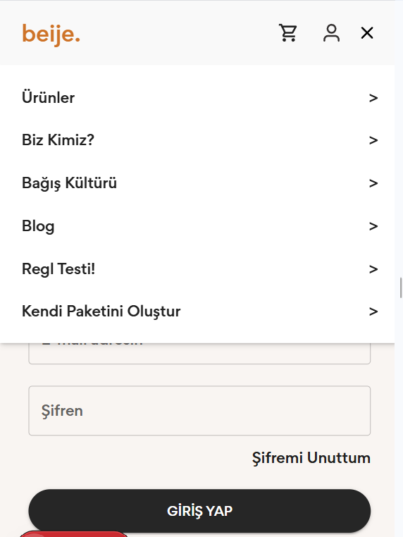
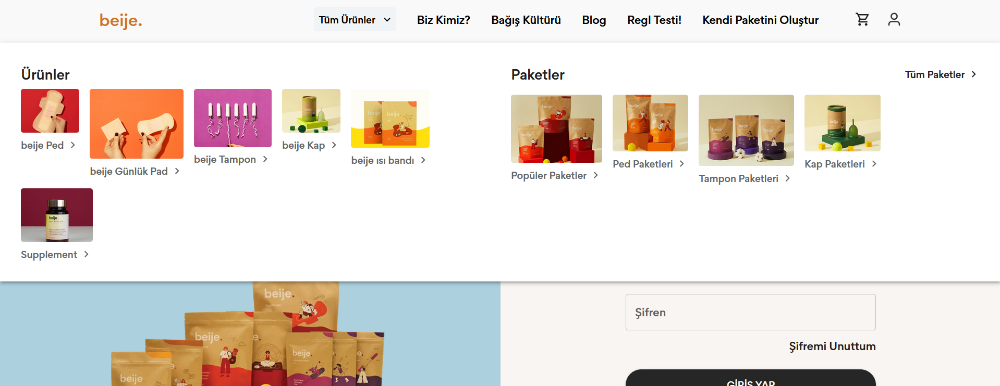
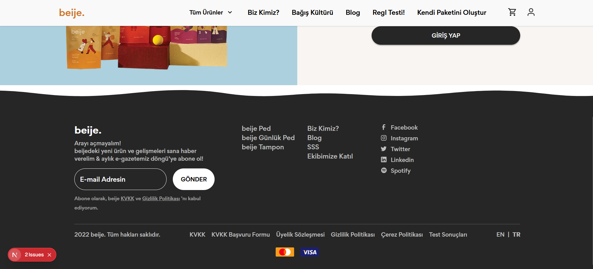
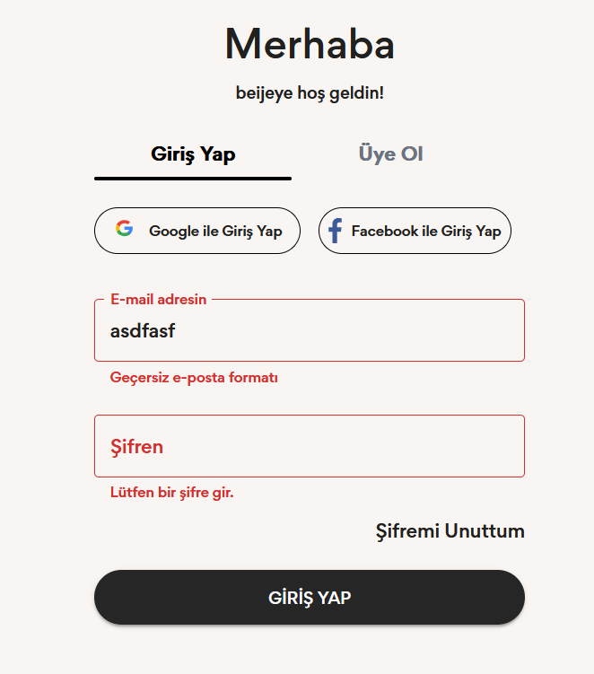
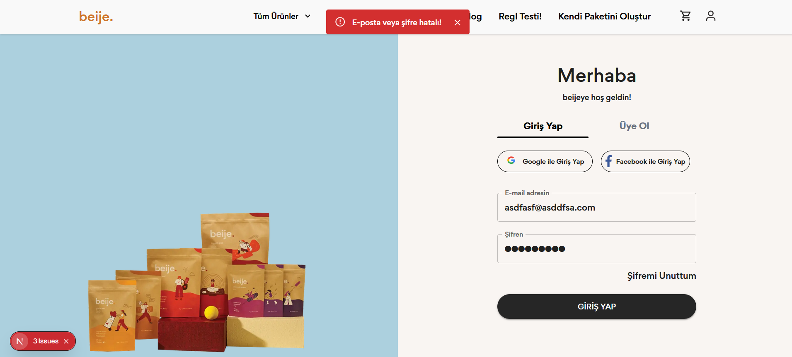
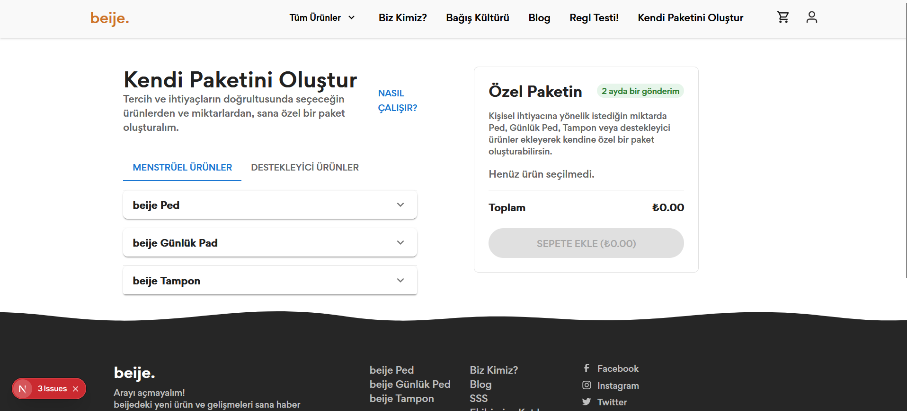
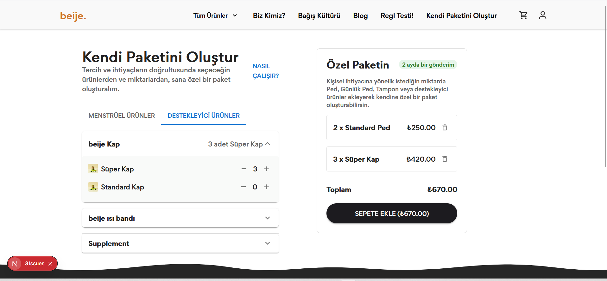
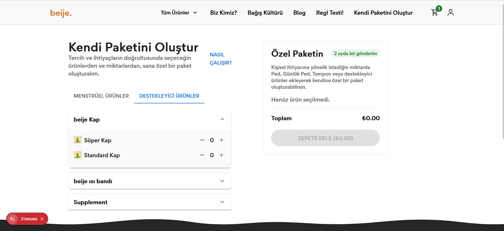

# 🔩 Proje Başlığı

Bu proje, Next.js ve Material-UI (MUI) ile geliştirilmiş olup Redux Toolkit ve Formik/Yup tabanlı bir frontend uygulamasıdır. Axios ile API entegrasyonu, Tailwind CSS ile ek stillendirme ve TypeScript desteği sunar.

## 🚀 Özellikler

- **Next.js 15** ile sunucu tarafı render
- **React 19** tabanlı güncel bileşen mimarisi
- **Material-UI (v7)** ve **Emotion** ile modüler, tema uyumlu stiller
- **Redux Toolkit** ve **redux-persist** kullanarak güvenilir global state yönetimi
- **Formik** ve **Yup** ile geliştirilmiş form doğrulama
- **Axios** ile API istekleri ve hata yönetimi
- **Tailwind CSS** ile yardımcı sınıflar ve PostCSS/Autoprefixer ile optimizasyonlar
- **TypeScript** ile tip güvenliği
- **ESLint** ve **eslint-config-next** ile tutarlı kod kalitesi

## 🧰 Teknolojiler ve Bağımlılıklar

### Dependencies

```json
{
  "@emotion/react": "^11.14.0",
  "@emotion/styled": "^11.14.0",
  "@mui/icons-material": "^7.0.2",
  "@mui/material": "^7.0.2",
  "@mui/system": "^7.0.2",
  "@reduxjs/toolkit": "^2.7.0",
  "axios": "^1.9.0",
  "formik": "^2.4.6",
  "next": "15.3.1",
  "react": "^19.0.0",
  "react-dom": "^19.0.0",
  "react-redux": "^9.2.0",
  "redux": "^5.0.1",
  "redux-persist": "^6.0.0",
  "redux-thunk": "^3.1.0",
  "yup": "^1.6.1"
}
```

### DevDependencies

```json
{
  "@eslint/eslintrc": "^3",
  "@types/node": "^20",
  "@types/react": "^19",
  "@types/react-dom": "^19",
  "autoprefixer": "^10.4.14",
  "eslint": "^9",
  "eslint-config-next": "15.3.1",
  "postcss": "^8.4.23",
  "tailwindcss": "^3.4.1",
  "typescript": "^5"
}
```

## Kurulum

1. Depoyu klonlayın:
   ```bash
   git clone https://github.com/kullanici/proje-adi.git
   cd proje-adi
   ```
2. Bağımlılıkları yükleyin ve build alın:
   ```bash
   npm install
   npm run build
   ```
3. Sunucuyu başlatın:
   ```bash
   npm run dev
   ```
4. Tarayıcınızda http://localhost:3000 adresini açın.

## 📷 Ekran Görüntüleri

### Login Sayfası



### Mobil Görünüm



### Navbar



### Footer



### Login Error



### Toast Mesajı



### Paketler



### Itemleri Sepete Ekleme



### Sepete Eklendikten Sonra



## License

[MIT](https://choosealicense.com/licenses/mit/)
